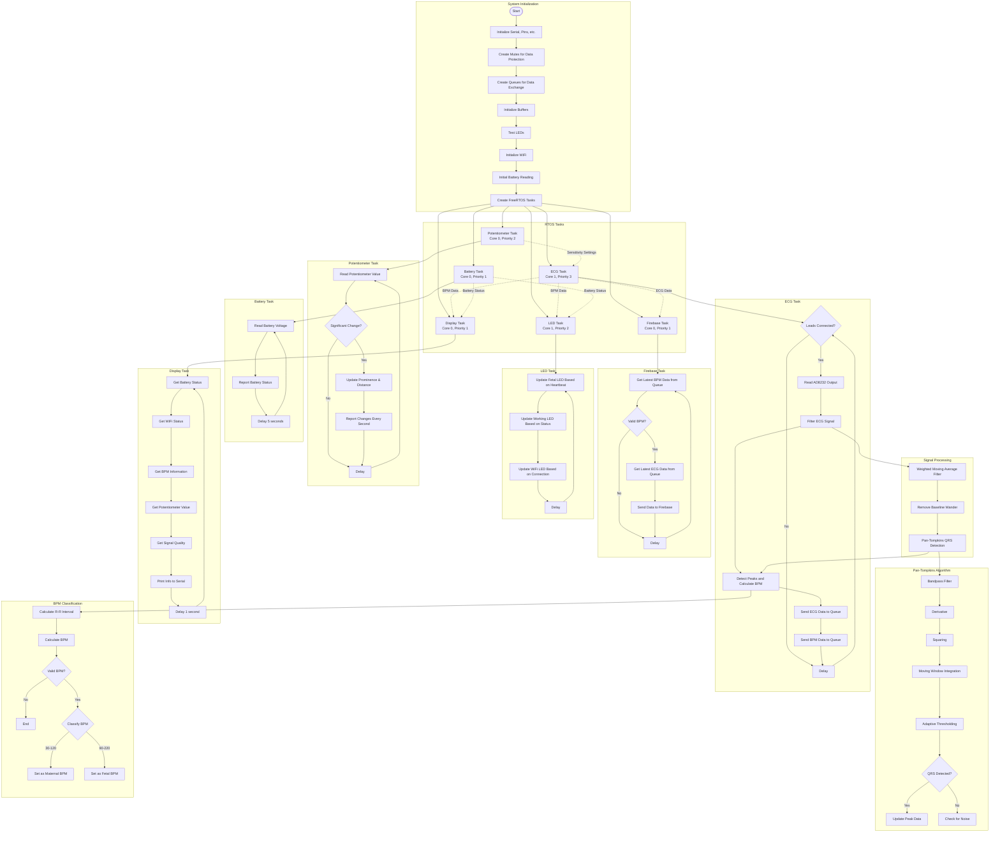

# ECG Monitoring System Flowchart (FreeRTOS)

## Main System Components

1. **Initialization System**
   - Sets up hardware, mutexes, queues, and creates RTOS tasks

2. **RTOS Tasks**
   - **ECG Task (Highest Priority)**: Reads and processes ECG signal, detects peaks, calculates BPM
   - **LED Task**: Updates status LEDs based on heartbeat, device operation, and WiFi status
   - **Battery Task**: Monitors battery voltage
   - **Potentiometer Task**: Reads potentiometer to adjust ECG sensitivity settings
   - **Firebase Task**: Sends ECG and BPM data to Firebase
   - **Display Task**: Outputs status information to serial monitor

3. **Signal Processing Pipeline**
   - Filtering: Weighted moving average and baseline removal
   - Pan-Tompkins QRS Detection Algorithm
   - Peak detection and BPM calculation
   - Heart rate classification (maternal vs. fetal)

4. **Inter-task Communication**
   - Uses queues for data exchange
   - Uses mutexes for safe access to shared data

## Hardware Connections

- **AD8232 ECG Sensor**: OUTPUT → Pin 35, LO+ → Pin 33, LO- → Pin 32
- **Potentiometer**: Middle pin → ESP32 pin 14
- **Status LEDs**: 
  - Fetal heartbeat → Pin 25
  - Working indicator → Pin 26
  - WiFi status → Pin 27
- **Battery Monitoring**: Pin 34 