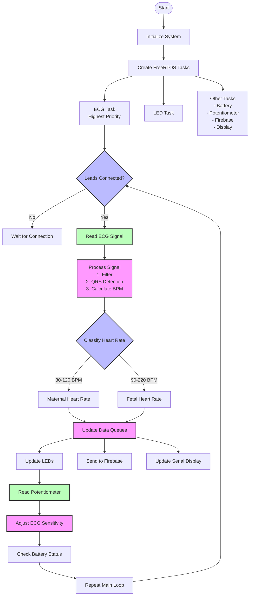

# ECG Monitoring System - Simplified Flowchart

## System Overview

1. **Initialization**
   - ESP32 startup and hardware setup
   - Create RTOS tasks

2. **Main Tasks**
   - **ECG Processing**: Capture and process ECG signal
   - **LED Control**: Visual feedback of system status
   - **Support Tasks**: Battery monitoring, potentiometer reading, data transmission

3. **ECG Signal Flow**
   - Read AD8232 sensor
   - Apply filters to clean the signal
   - Detect QRS complexes using Pan-Tompkins algorithm
   - Calculate and classify heart rates as maternal or fetal

4. **Output Handling**
   - Visual feedback through LEDs
   - Data transmission to Firebase
   - Serial output for debugging

## Hardware Setup

- **ECG Sensor**: AD8232 connected to ESP32
- **User Interface**: Status LEDs and calibration potentiometer
- **Power Management**: Battery monitoring
- **Connectivity**: WiFi for Firebase data transmission 